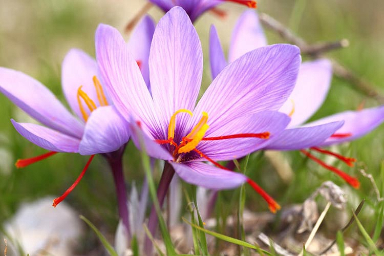
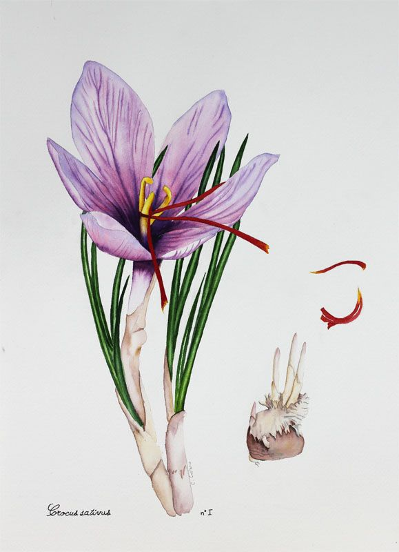

# 藏红花 （Saffron Crocus）

* 公元前1600年克里特岛上的[米诺斯文明](https://baike.baidu.com/item/%E7%B1%B3%E8%AF%BA%E6%96%AF%E6%96%87%E6%98%8E/744324)（Minoan）的壁画上就有描绘种植藏红花的场景
* 藏红花现今种植于西起摩洛哥、东至中国西部的地区。伊朗的产量最大，西班牙产的质量最好。
* 藏红花花朵为紫色，雄蕊为蓝色，柱头为红色，其中含有香料成分。藏红花的名称来源于阿拉伯语zaffaran，是黄色的意思。
* 藏红花没有繁殖能力，只能通过分离球茎来繁殖。
* 藏红花很可能是通过印度、由西藏传入中国。
* 一克藏红花需要十五万朵花的花柱。
* 藏红花在古代被认为有药用效果，埃及艳后克利奥帕特拉曾用它泡水洗澡。

|  |  |
| - | - |